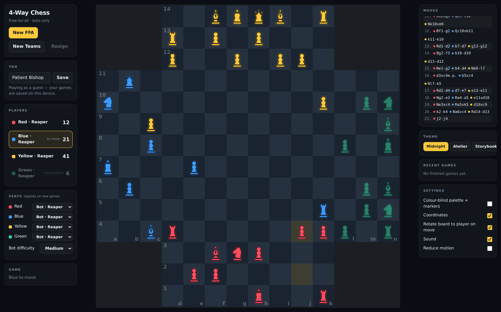
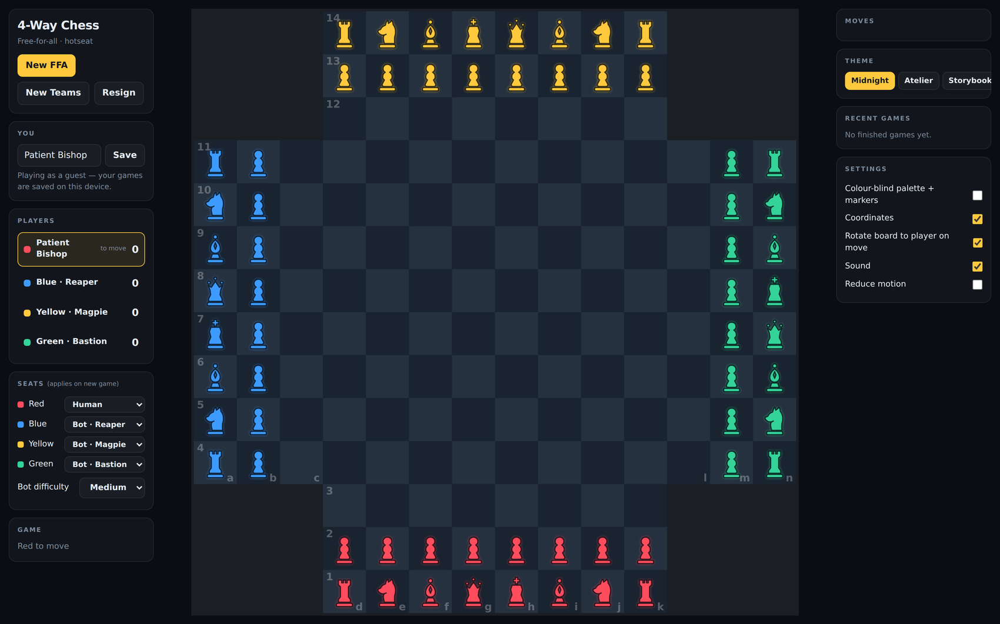
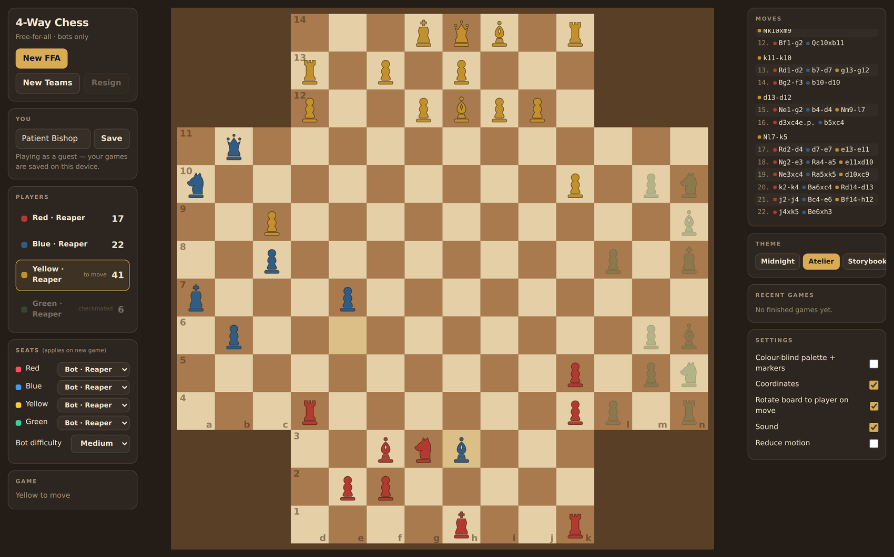
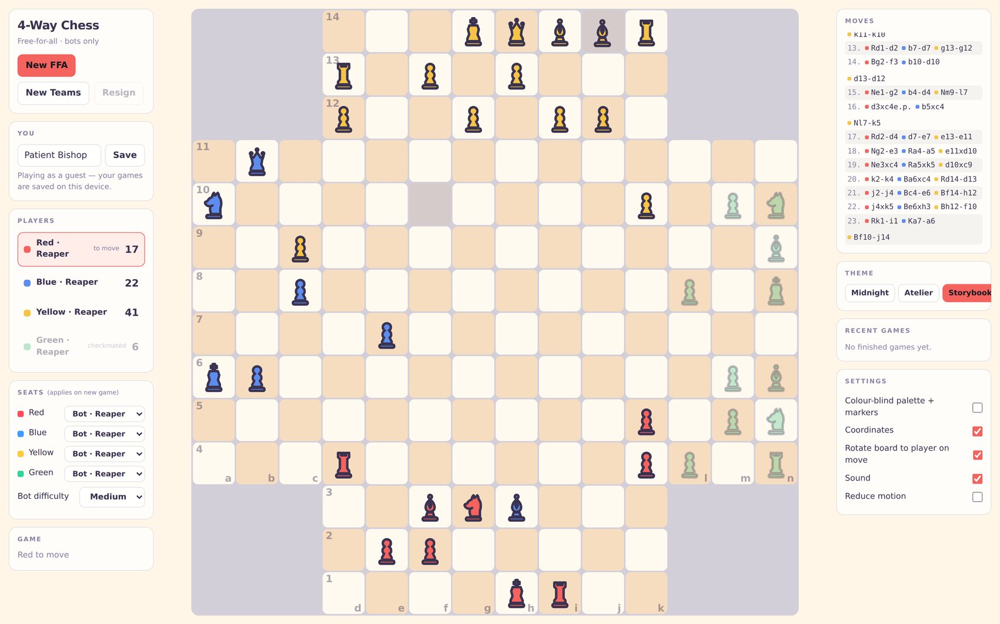

# 4-Way Chess

A four-player chess implementation for the 14×14 board: rules engine, bots, and a web client, in a TypeScript monorepo.

The interesting part is not the game. It is the correctness problem underneath it.

## What it looks like

A bot-vs-bot free-for-all, twenty-one moves in. Green has been checkmated and is greyed out: dead pieces never move and never give check, but they still block movement and can be captured for zero points, so they become pure terrain. Scores on the left are the FFA points race, which is how the game is actually won. In the move list, `d3xc4e.p.` is an en passant capture across perpendicular pawn walls.



The opening position. Every army's back line reads `RNBQKBNR` from its own left, which makes the position 90° rotationally symmetric and is the divergence from chess.com described in `docs/RULES.md` §4.2.



Three themes, switchable mid-game.

| Atelier | Storybook |
|---|---|
|  |  |

## The correctness problem

Standard chess engines prove their move generation is right by comparing `perft` node counts against published reference data. Everyone uses the same numbers, so a bug shows up immediately.

**No such reference data exists for four-way chess.** There is nothing to check against, and this ruleset deliberately diverges from chess.com's at four squares (see `docs/RULES.md` §4.2), so even borrowing their behaviour would not settle it.

So correctness rests on three legs instead:

1. **Differential testing.** `naive.ts` implements the entire ruleset a second time, sharing no logic with the fast path. It brute-forces every ordered square pair and re-derives paths from scratch, where `movegen.ts` uses reverse attack detection and precomputed tables. The two implementations must agree across millions of positions reached by random play, in both game modes, with random eliminations mixed in. Two independent implementations agreeing is real evidence. One implementation agreeing with itself is not.

2. **Frozen perft baselines.** Not externally verified, but any change that moves a number gets caught on the next run. Worth noting the opening is a *weak* target here: the four armies cannot reach each other in the first round, so perft to depth 4 contains zero captures. A tactical position is frozen alongside it for that reason.

3. **Named rule tests.** Every rule in `docs/RULES.md` has a test that cites its section number, so the spec and the suite cannot drift apart silently.

## The one architectural rule

> The rules engine is a pure, dependency-free TypeScript package with no I/O, no framework, and no knowledge of how it is transported or drawn.

Everything downstream is a consumer of that package: the web client, the eventual mobile client, the bots, the authoritative server, analysis, replay. That is what keeps every other decision reversible.

The purity constraints are enforced by `test/architecture.test.ts`, not by convention:

- no external imports, only relative paths and `node:` builtins
- no I/O, no network, no `console`, no browser globals, no `Buffer`
- no `Math.random`, no `Date.now`, so the engine is deterministic
- no imports from `apps/*`
- erasable syntax only, so Node's native type stripping runs it with no build step

The engine has **zero dependencies, including dev dependencies.** Tests run on Node 24's built-in test runner and native TypeScript type stripping. Nothing to install, nothing to bundle.

## The army-local frame

The single idea that makes four-way chess tractable.

Four armies facing four directions invites special-casing every rule four ways, which is where four-way engines usually go wrong. Instead each army gets a local frame where `ownFile` runs 1 to 8 from its own left and `ownRank` runs 1 to 14 forward from its own back line:

| Army | ownFile | ownRank |
|---|---|---|
| red | `x − 2` | `y + 1` |
| blue | `11 − y` | `x + 1` |
| yellow | `11 − x` | `14 − y` |
| green | `y − 2` | `14 − x` |

In that frame all four armies are identical. Every back line reads `RNBQKBNR`, every king starts on own(5,1), and castling and promotion become ordinary chess rules. Transform once, then write conventional logic.

One caveat found the hard way: pawns capture diagonally into the side arms, so **`ownFile` is not bounded to 1 through 8.** It legitimately reaches 0 and below. Code that assumes otherwise is wrong, and ours was, until the differential tester caught it.

## Rules worth reading about

`docs/RULES.md` is the full specification, 290 lines, every rule marked DECIDED, PROPOSED, or VERIFY. Nothing is left implicit, because undocumented behaviour becomes accidental canon the moment a player sees it.

Three that are more subtle than they look:

**Checkmate is assessed only when the mated player's turn arrives**, not when the mating move is played. A player who is "mated" but whose attacker gets eliminated first is not mated. This is load-bearing and has dedicated tests.

**A king can be captured by a third party.** It follows directly from the rule above: a checked player's king can be taken before they ever get to respond. Without this, a kingless army would be permanently immune to check and could never be eliminated at all.

**Check bonuses count only checks the move delivers.** Because two opponents move between your check and the victim's reply, a check you delivered earlier is still standing on your next turn. If standing checks scored, a player could park one permanent check and farm the bonus forever, which would poison the whole points race.

## Layout

```
packages/
  engine/        pure TS rules engine. zero deps.
  bots/          heuristic evaluation + shallow max-n search, by personality
  board-render/  Skia drawing layer, shared web and mobile
  ui-core/       framework-free view model
  pieces/  rating/  store/
apps/
  web/           web client
docs/
  RULES.md       the full ruleset specification
  ARCHITECTURE.md  decision register with status per decision
  ROADMAP.md  RISKS.md  COSTS.md  RATING.md
```

## Running it

Node 24 or newer (`.nvmrc` pins it — `nvm use` picks it up). The engine relies on
Node's native type stripping, so there is no build step to run first.

```bash
npm install
npm run dev            # web client
npm test               # all workspaces
npm run test:engine    # engine only, 142 tests
npm run perft          # frozen perft baselines
```

Deep correctness sweep:

```bash
node packages/engine/src/tools/differential-cli.ts 1000000
```

## License

Source-available for reading and evaluation. See `LICENSE`. Not open source.
